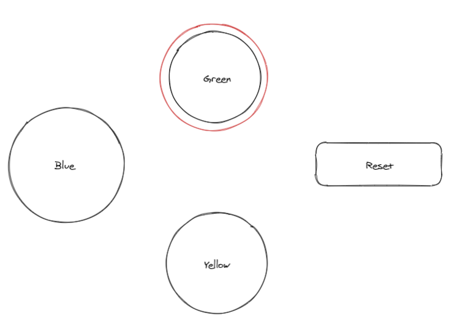

### Requirement

Build a game with 4 buttons, the UI looks like this. The UI should be responsive. The reset button is the only one that gets moved as the screen size changed.

### Engine rule

- You'll start from Blue
- Reset will put you back to Blue
- From Blue, you can go with Green
- From Blue, you can go with Yellow
- From Green, you can only go to Blue
- From Yellow, you can only go to Blue
- You cannot visit Yellow consecutively
    - ✅ Blue → Yellow
    - ✅ Blue → Green → Blue → Yellow
    - ✅ Blue → Green → ... → Blue → Green → Blue → Yellow
    - ⛔ Blue → Yellow → Blue → Yellow
    - ⛔ Blue → Green → Blue → Yellow → Blue → Yellow

### What will you implement for the fullstack position

- UI to display the state. The currently selected button will be a highlight in Red. Only enable possible moves of the current state
- Clicking button will cause the engine to move to its next stage
- Implement the backend and expose necessary APIs to progress to the next stage. Imagine something like `/api/transition/<nextstep>` where `nextstep` is the variable. The Impossible state should return status 400. For example, `/api/transition/yellow` while the current state is "Green" is invalid
- Write the README file so people can work on the repo as well
- Explain how'll you test the application
- Prefer, work to be done in Typescript and ReactJS

### What will you implement for the frontend position

- Implement the engine logic in frontend. The state should be persisted on the client side, as such, the state will be kept across page refreshes
- UI to display the state. The currently selected button will be a highlight in Red. Only enable possible moves of the current state
- Clicking button will cause the engine to move to its next stage
- Write the README file so people can work on the repo as well
- Explain how'll you test the application
- Prefer, work to be done in Typescript and ReactJS

### What we'll evaluate

- How clean is your solution
- Professional code quality
